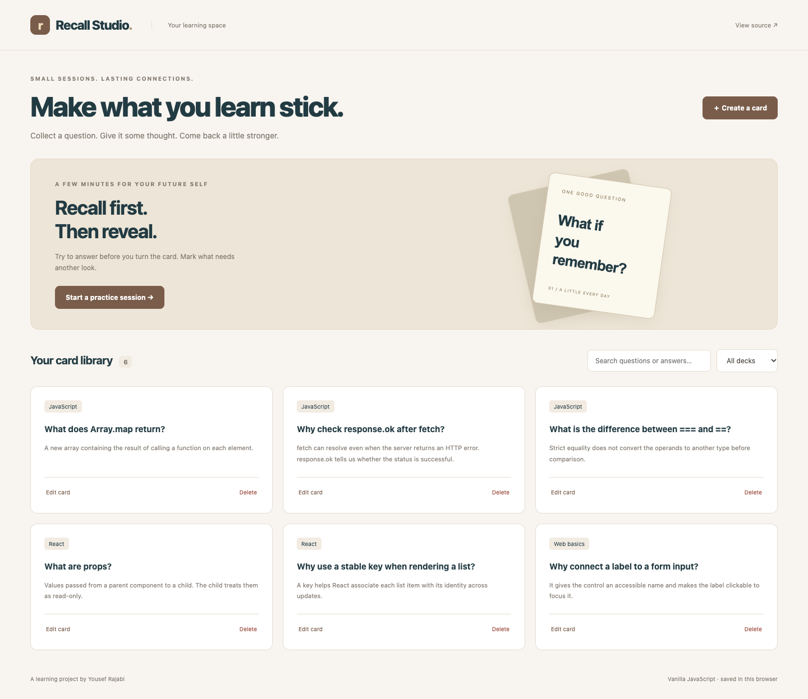

# Recall Studio

A focused flashcard studio built with plain JavaScript to practice the fundamentals.

**A junior-level, AI-assisted portfolio learning project by Yousef Rajabi.**

## Screenshot



[Mobile screenshot](docs/screenshots/mobile.png) · [Learning guide](docs/LEARNING.md) · [Checks](https://github.com/yousefrajabi06-debug/recall-studio/actions)

Screenshots show the running application with fictional sample data. They are not design mockups.

## Live Demo

[Open Recall Studio](https://yousef-recall-studio.netlify.app/)

Data stays in localStorage in this browser; use fictional records for the public demo.

## Why this project

Adds direct DOM programming and a multi-step review session instead of making every project a React CRUD app.

## Features

- Create, edit, and delete cards grouped by deck.
- Search questions/answers and filter decks.
- Practice the visible set, reveal answers, and rate recall.
- See a session summary and repeat only the missed cards.
- Persist a validated card library locally with visible write failures.
- Load a small original JavaScript study deck as an optional example.

## Tech Stack

HTML, CSS, vanilla JavaScript ES modules, DOM APIs, localStorage, Vite, Playwright.

## Installation

Use **Node.js 24+** and npm. Install dependencies from the project directory:

```bash
git clone https://github.com/yousefrajabi06-debug/recall-studio.git
cd recall-studio
npm install
npm run dev
```

Open the local Vite URL printed in the terminal (normally http://127.0.0.1:5173).

No secret API keys are required. Never put credentials in frontend code. Dependencies are locked in `package-lock.json`; use `npm ci` for a reproducible clean install.

## Production build

```bash
npm run build
npm run preview
```

The build output is `dist/`. Preview is a local build check, not a hosted production service.

## Tests

```bash
npx playwright install chromium
npm test
```

If Chrome is already installed locally, macOS/Linux users can instead run `PLAYWRIGHT_CHANNEL=chrome npm test`. Browser tests use local development servers. GitHub Actions performs `npm ci`, builds the project, installs Chromium, and runs the tests on pushes and pull requests.

Three browser tests cover card CRUD and persistence, review/repeat-missed behavior, safe user-text rendering, and mobile layout.

## Source organization

- [`src/main.js`](src/main.js): DOM rendering, event handlers, card forms, and review-session state.
- [`src/lib/storage.js`](src/lib/storage.js): Saved-card validation and localStorage read/write handling.
- [`src/styles.css`](src/styles.css): Responsive library, forms, and practice view.
- [`tests/app.spec.js`](tests/app.spec.js): Card CRUD, persistence, review progression, safe rendering, and mobile checks.

## What I Learned

This AI-assisted implementation provides practice with the following concepts. These are study outcomes to work through, not a claim that every line was written independently:

- Trace an event handler from a user action to state and a DOM update.
- Explain why user content is rendered with textContent/value rather than HTML interpolation.
- Keep the card library separate from the active review-session queue.
- Use array methods to compute missed cards and restart a focused session.
- Understand ES module imports and localStorage serialization.

See [the learning guide](docs/LEARNING.md) for an independent feature exercise and a rebuild plan.

## Limitations and data

A small local practice tool, not a scientifically validated learning system. No accounts, sync, encryption, or long-term scheduling. Clearing browser data removes the library. Reads are synchronous; the UI shows empty/error states rather than an artificial loading spinner.

The responsive UI includes visible keyboard focus and labeled controls. Browser tests are useful regression checks; they are not a complete accessibility audit. No private personal data, real credentials, generated databases, or `.env` files are committed. External Google Fonts are optional cosmetic requests; system font fallbacks keep the interface usable if fonts are unavailable.

## Future Improvements

- A simple spaced-repetition schedule after understanding the current session flow.
- Import/export decks with schema validation.
- Split library and practice DOM rendering into separate modules as the app grows.

## Authorship and AI assistance

Created for Yousef Rajabi's student portfolio with AI assistance in planning, implementation, testing, and documentation. Original project code was built for this portfolio; it was not copied from another GitHub application. Third-party libraries remain credited through the Tech Stack and dependency files. This is learning work, not paid client work or invented professional experience.
